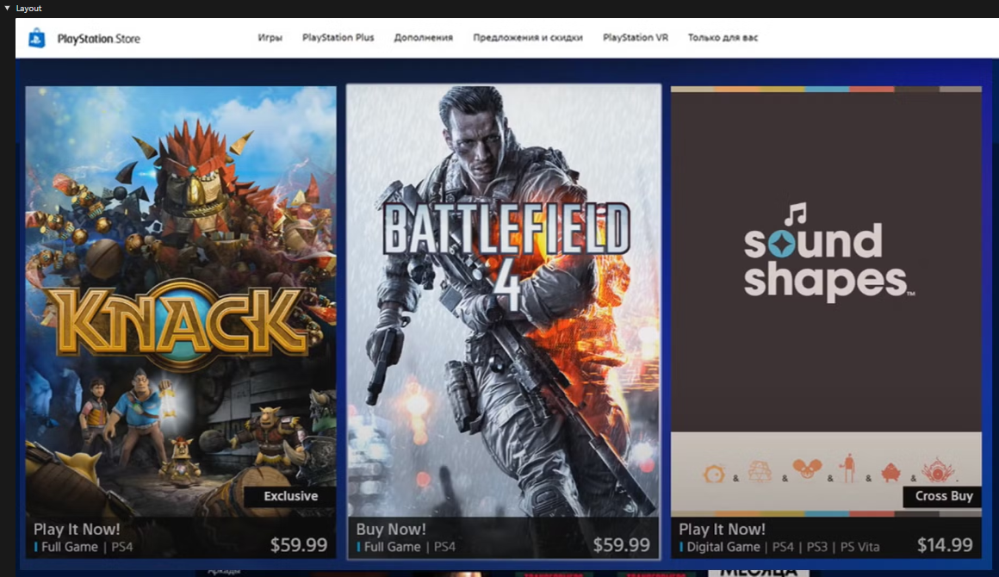
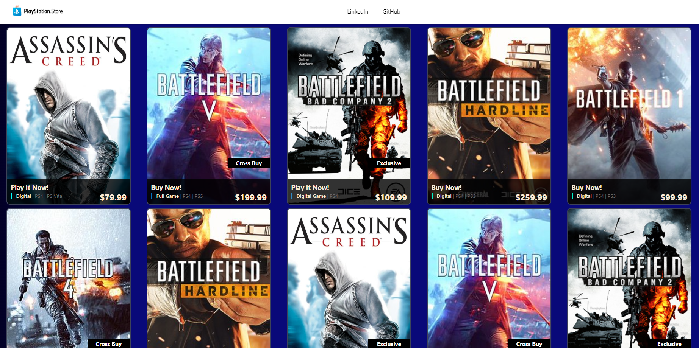

# AngularStore

Recreating the Playstation Store in Angular

## Home Page

## How to Run

Insert these comands in comand line

- `npm install` -> _Installs the project dependencies_

- `ng serve` -> _Starts the Angular application in a development server_

If you want Angular to open automatically in the browser, use:

- `ng serve --open`
